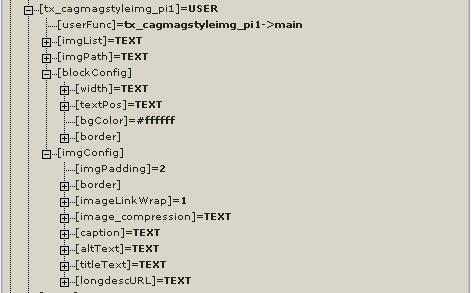

.. ==================================================
.. FOR YOUR INFORMATION
.. --------------------------------------------------
.. -*- coding: utf-8 -*- with BOM.

.. include:: ../Includes.txt

Configuration
-------------

Technical background
^^^^^^^^^^^^^^^^^^^^

The plugin is inserted into your TypoScript configuration as
**plugin.tx\_cagmagstyleimg\_pi1** and then copied into tt\_content.
This way you have the utmost flexibility. Within the context of
tt\_content, the plugin uses the properties **.text, .textMargin and**
**.layout** from **tt\_content.image.20** for positioning the magazine
imageblocks in regard to the text.

TypoScript Configuration
^^^^^^^^^^^^^^^^^^^^^^^^

Care has been taken to give you a good amount of TS options. See the
table below for what you can do.

.. container:: table-row

   Property
         imgList

   Data type
         string / stdWrap

   Description
         FILES object that fetches the image references from FAL.

.. container:: table-row

   Property
         layout

   Data type
         CASE

   Description
         Only active when used as a CE. Defines the outer wraps for the CE.
         Compare tt\_content.image.20.layout

.. container:: table-row

   Property
         text

   Data type
         COA

   Description
         Only active when used as a CE. Gets the text from DB. Compare
         tt\_content.image.20.text

.. container:: table-row

   Property
         textMargin

   Data type
         int

   Description
         Only active when used as a CE. This defines the margin to the
         surrounding text.

   Default
         10

.. container:: table-row

   Property
         textMargin.addBorderWidth

   Data type
         boolean

   Description
         If this is true, the width of any borders (left and right) surrounding
         the magazine imageblocks will be added to the value in .textMargin.
         This is necessary to get a straight margin for the intext-nowrap
         position types.

   Default
         1

.. container:: table-row

   Property
         layoutWraps

   Data type
         array / stdWrap

   Description
         Below this property are the six different magazine layout wraps (1a,
         2a, 3a, 3b, 4a, 4b). The numbers correspond to the image numbers each
         layout uses. All numbers have stdWrap.

.. container:: table-row

   Property
         width

   Data type
         TEXT / stdWrap

   Description
         This defines the maximum width for the imageblocks. Normally, the
         width is taken from field imagewidth, but if this is empty, this
         standard value is used. Value is written to the global
         register:msiBlockWidth.

   Default
         600

.. container:: table-row

   Property
         blockWrap

   Data type
         dataWrap

   Description
         This wrap surrounds the magazine imageblocks. It's a dataWrap so you
         can insert values from global registers and do other TS stuff.

.. container:: table-row

   Property
         bgColor

   Data type
         color

   Description
         A standard color value for the background of the magazine imageblocks.
         Value is written to the global register:msiBlockBgColor.

   Default
         #ffffff

.. container:: table-row

   Property
         border (width, style, color)

   Data type
         string

   Description
         With these attributes you can define a standard CSS border around the
         magazine imageblocks. Values are written to the global
         register:msiBlockBorder.

   Default
         1 solid #eeeee

.. container:: table-row

   Property
         imgPadding

   Data type
         number

   Description
         Defines the distance between the images within the block.

   Default
         2

.. container:: table-row

   Property
         border (width, style, color)

   Data type
         string

   Description
         With the attributes of this TS property you can define a standard CSS
         border around each image within the block.

   Default
         1 solid #eeeee

.. container:: table-row

   Property
         imageLinkWrap

   Data type
         wrap

   Description
         See .imageLinkWrap property in TSRef

   Default
         enabled

.. container:: table-row

   Property
         image\_compression

   Data type
         TEXT / stdWrap

   Description
         This sets the quality and format of the resized images.

   Default
         field: imagecrompression

.. container:: table-row

   Property
         caption

   Data type
         TEXT / stdWrap

   Description
         Gets the caption for the imageblock from a field in DB. You can insert
         the caption into the magazine imageblocks by using the ###CAPTION###
         marker.

   Default
         field:imagecaption

.. container:: table-row

   Property
         altText

   Data type
         TEXT / stdWrap

   Description
         Gets the text for the alt attributes of each image from a field in DB.
         Uses split so that each image gets it's appropriate attribute.

   Default
         Field: altText

.. container:: table-row

   Property
         titleText

   Data type
         TEXT / stdWrap

   Description
         Gets the text for the title attributes of each image from a field in
         DB. Uses split so that each image gets it's appropriate attribute.

   Default
         field: titleText

The MAG\_IMG\_CURRENT register
^^^^^^^^^^^^^^^^^^^^^^^^^^^^^^

From version 0.1.3 a global register 'MAG\_IMG\_CURRENT' which holds
all important image information for each magazine image is accessible
in the Frontend. This is comfortable if you need to fetch some image
values via TypoScript for some special purpose (light a lightbox
etc.). You can access the values using the .data property.

**Example:**

::

   my.config.data = TSFE:register|MAG_IMG_CURRENT|value

And here are the values of the register:

+----------------+---------------------------------------------------------------+
| Value          | Description                                                   |
+================+===============================================================+
| number         | The number of the current magazine image (starts with 0)      |
+----------------+---------------------------------------------------------------+
| filename       | Name of the image                                             |
+----------------+---------------------------------------------------------------+
| imgPath        | The path to the image                                         |
+----------------+---------------------------------------------------------------+
| fullImgPath    | Path + name                                                   |
+----------------+---------------------------------------------------------------+
| ext            | The file extension (.jpg, .gif etc.)                          |
+----------------+---------------------------------------------------------------+
| format         | Landscape or portrait                                         |
+----------------+---------------------------------------------------------------+
| ratio          | The ratio which is used to set the images in proportion       |
+----------------+---------------------------------------------------------------+
| w              | The width of the scaled image                                 |
+----------------+---------------------------------------------------------------+
| h              | The height of the scaled image                                |
+----------------+---------------------------------------------------------------+
| altText        | Alternative text belonging to the image                       |
+----------------+---------------------------------------------------------------+
| titleText      | Title text belonging to the image                             |
+----------------+---------------------------------------------------------------+
| caption        | Imagecaption belonging to the image                           |
+----------------+---------------------------------------------------------------+

Some TypoScript examples
^^^^^^^^^^^^^^^^^^^^^^^^

This section wants to give some examples of what you can do using
TypoScript and the  **.blockWrap** and  **.layoutWraps** properties.

**Example 1: Changing the caption to be outside the magazine blocks**

I want the caption not to be inside the magazine imageblocks but
outside. I can do this by changing the .blockWrap property like this:

*Before:*

::

   tt_content.cag_magstyleimg_pi1.20 {
           blockConfig {
                   blockWrap = 
|

###CAPTION###

           }
   }

*After:*

::

   tt_content.cag_magstyleimg_pi1.20 {

           # put caption marker to a place outside
           blockConfig {
                   blockWrap = 

|

###CAPTION###

           }
           # give the caption the same width so that it won't exceed the imageblock
           imgConfig.caption {
                   outerWrap >
                   dataWrap = 
|

           }
   }

As you can see, I have added another inner div with all the register
values for the magazine images and put the ###CAPTION### marker
outside of it. Then I have wrapped the caption within a P tag with a
fixed width. Now the caption will be outside the magazine imgeblock
borders but still have the appropriate width.

**Example 2: Numbering the images**

Since the numbers below the  **.layoutWraps** property have stdWrap
properties, its possible to do some parsing with TypoScript. You could
– for instance – insert the number of each magazine image:

::

   # the php array starts at '0' – we need to raise each number by 1
   temp.increment = LOAD_REGISTER
   temp.increment {

           tempnumber = TEXT
           tempnumber.data = TSFE:register|MAG_IMG_CURRENT|number
           tempnumber.wrap = |+1

           imgnumber = TEXT
           imgnumber.data = register:tempnumber
           imgnumber.prioriCalc =  1
   }

   # change the layoutWraps of patterns 2a and 3b and use .dataWrap
   tt_content.cag_magstyleimg_pi1.20.layoutWraps.2a {

           1.wrap >
           1.preCObject < temp.increment

           1.dataWrap = 
{register:imgnumber}|

           2 < .1
           2.dataWrap = 
{register:imgnumber}|

   }

   tt_content.cag_magstyleimg_pi1.20.layoutWraps.3b {

           1.wrap >
           1.preCObject < temp.increment

           1.dataWrap = 
{register:imgnumber}|

           2 < .1
           2.dataWrap = 
{register:imgnumber}|

           3 < .2
   }

Using the plugin with other TS Objects and/or DB fields
^^^^^^^^^^^^^^^^^^^^^^^^^^^^^^^^^^^^^^^^^^^^^^^^^^^^^^^

You can use the plugin TS for different purposes. For example for
rendering some images from another source (like the media field in
pages table). In that case you would copy the plugin into one of your
TS objects, and afterwards change the field and path to the images:

**Example configuration:**

::

   temp.myspecialmags < plugin.tx_cagmagstyleimg_pi1
   temp.myspecialmags.imgList.field = media
   temp.myspecialmags.imgPath.value = uploads/media/

   page.10 < temp.myspecialmags