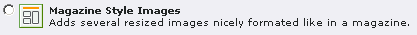
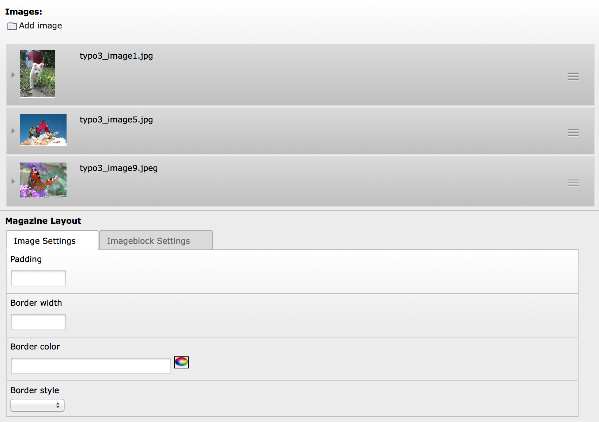
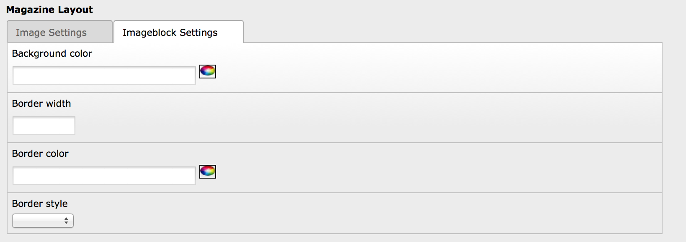

.. ==================================================
.. FOR YOUR INFORMATION
.. --------------------------------------------------
.. -*- coding: utf-8 -*- with BOM.

.. include:: ../Includes.txt

Users manual
------------

Basic idea
^^^^^^^^^^

The basic idea is to have  **up to eight** user submitted images in a
content element automatically resized and set in proportion within a
nicely arranged imageblock. Neither size nor order of images should
matter – they are arranged automatically using one of six layout
patterns. Depending on the ratio (landscape:portrait) and the number
of images supplied 44 magazine layouts are possible. For in-depth
study I recommend reading Harvey Kanes article on A List Apart:
`http://www.alistapart.com/articles/magazinelayout
<http://www.alistapart.com/articles/magazinelayout>`_ .

Requirements
^^^^^^^^^^^^

For using this extension you will need a running  **ImageMagick** or
**GraphicsMagick** installation (which you should have anyway for
TYPO3 ;)

The current version of the extension was developed for use with TYPO3 6.0+
and css\_styled\_content. It uses some TypoScript from tt\_content.image
to position the magazine imageblocks and text respectively. The
\_DEFAULT\_CSS\_STYLES from css\_styled\_content are used as well.
Therefore, the CSS classes are the same as for the standard image
content elements. This should save you the work of styling things
twice.

Browser support
^^^^^^^^^^^^^^^

**Supported HTML/XHTML doctypes:**

The original PHP script works with documents served as XHTML
transitional. I did some testing and it seems that all magazine
layouts are fully supported by most modern web browsers (Firefox,
Opera, Safari etc). This includes Internet Explorer 6 and 7  **as long
as** you serve your documents with one of the following doctypes:

- XHTML 1.0 transitional
- XHTML 1.0 strict
- HTML 4.01 strict
- HTML 5

For serving the magazine imageblocks with STRICT DOCTYPES, you have to
add the following CSS rule to your stylesheet:

::

   div.msi-blockwrap > div[style] {line-height: 0;}

Gecko browsers treat the line-height differently in STRICT DOCTYPES
and  **without** this rule you will get a 3px gap below each image
within a magazine imageblock in Firefox et.all. It is important that
IE 6 and 7  **do not see** this rule – it will ruin the imageblock
captions. In the example above I have used an advanced selector that
only the Gecko browsers understand. Alternatively, you could use
conditional comments and set the line-height back to normal in IE by
using a stylesheet only served to this browser family.

**Unsupported doctypes:**

In any HTML document that triggers  **quirksmode** in IE 6 and 7 some
of the magazine layouts will break (mind you: this can also happen in
XHTML documents if the doctype is  **not** served before all other
content!)

Installation
^^^^^^^^^^^^

1. Go to the extension manager and import the extension from TER.

2. A new field “tx\_cagmagstyleimg\_flex” will be added to the
   tt\_content table.

3. Once you have installed the extension, go to the root template of the
   website. Include the "Magazine Style Images" TypoScript in the
   "Include static (from extension)" field.

4. Make sure that the TypoScript is included AFTER css\_styled\_content

5. Now the new content element is ready to use.

The Magazine Images Content Element
^^^^^^^^^^^^^^^^^^^^^^^^^^^^^^^^^^^

The backend form of the “Magazine Images” content element looks like
this:

The original script does support  **up to eight images** and so does
this plugin. If you insert more than eight images into the images
field, only the first eight will be taken into account.

The Magazine Layout content element has an additional, flexform based field.
With this you can configure a lot of extras. Like the padding between the images,
if there should be a border around the images and/or the magazine imageblock,
the border styles and even the backgrounds for the magazine imageblocks. If you
don't want your editors to influence this, exclude the field from their group
and set standard values with TS.

Deinstallation
^^^^^^^^^^^^^^

1. Drop the TypoScript from your root template.

2. Deinstall the extension with EM.

3. Drop the field tx\_cagmagstyleimg\_flex from the database by using the
   COMPARE function of the install tool.